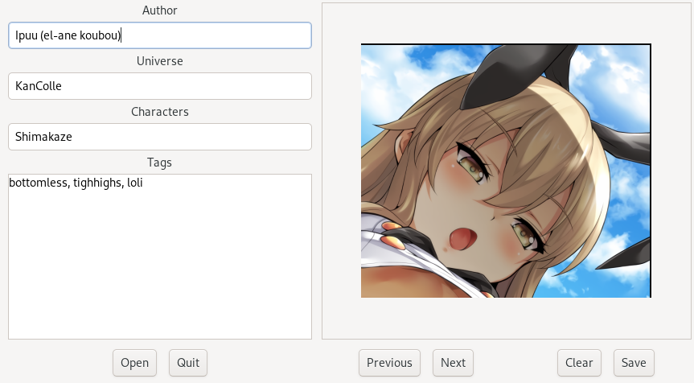

# The Hentai Image Classifier
The Hentai Image Classifier (クラシファイア), in spite of its maybe misguiding name, is a metadata editor with the erotic
Japanese-style drawings in mind.



It can open a directory, scan it for images and present you a simple interface to sequentially add, edit or clear their
metadata. This metadata is recorded into XML files name-wise paired with images: if the image is `foo.png`, then its
accompanying metadata file is called `foo.xml`, and resides under the same directory.

### Metadata format and rationale
Metadata files comply with the following DTD:
```dtd
<!ELEMENT image (author?,universe?,characters?,tags?)>
<!ATTLIST image id ID #REQUIRED
          filename CDATA #REQUIRED>
<!ELEMENT author (#PCDATA)>
<!ELEMENT universe (#PCDATA)>
<!ELEMENT characters (character+)>
<!ELEMENT character (#PCDATA)>
<!ELEMENT tags (tag+)>
<!ELEMENT tag (#PCDATA)>
```
This way of storing metadata in self-contained XML files simplifies metadata updates while still allowing for easy data
integration and consolidation.
<br>
For example, one could implement an ETL pipeline starting with a fully-textual concatenation of the files, then
enclosing the result into a suitable root element before feeding everything to an XML processing system (e.g. XML DBMS,
knowledge system, ...).

## Building and testing
### Dependencies
HImaKura is a [Python 3](https://python.org) application using [GTK 3](https://gtk.org) for the UI and
[PyGObject](https://pygobject.readthedocs.io) as a language binding for GTK.

#### Runtime
All runtime dependencies I am aware of should be recursively satisfied by having on your system:
- Python 3
- GTK 3
- gobject-introspection

#### Build-time
Build and test steps employ a dedicated [virtualenv](https://docs.python.org/3/tutorial/venv.html) in which all
dependencies are installed via pure Python packages and wheels. [PEX](https://github.com/pantsbuild/pex) is used for
packaging the final application. If you plan on running these steps while offline, make sure to have these packages
in your local cache, or instantiate the virtualenv beforehand.

If I missed some dependencies, let me know.

### Test
`git clone` the repository and then, as customary:
```shell script
cd HImaKura
make test
```
and a battery of unit tests will be run, and results reported.

### Build
While inside the cloned repo:
```shell script
make build
```
This will create a .pex file under `./build`, which can then be executed as a standalone application.

### Clean up
Just run:
```shell script
make clean
```
and the build directory, virtualenv and caches will be gone.

## TODO
### Backend
* Implement proper metadata deletion
* Test more.

### UI
* Slide-show mode

### New functionality
* Image deletion
* Bulk metadata export
* Search filter
